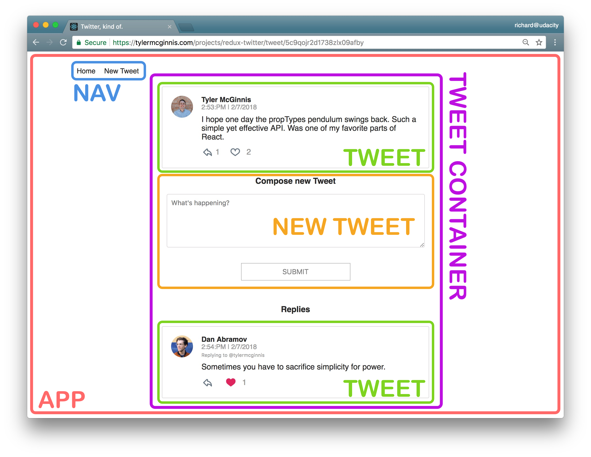

# Chirper Project

This repo is a code-along with the first project in the [React Nanodegree program](https://www.udacity.com/course/react-nanodegree--nd019).

Building this simple Twitter clone help practice improving the predictability of an application's state; establishing strict rules for getting, listening, and updating the store; and identifying what state should live inside of Redux and what state should live inside of React components.

# UI
## Design

# Project Setup

* install the dependencies - `npm install`
* npm update. stop the server and run following - `npm add react-redux' 'npm update react react-dom`,  `npm add redux`
* `add redux-thunk`
* If you get the error TypeError: Cannot call a class as a function, check you haven't imported thunk from react-thunk rather than redux-thunk.
* add router `npm add react-router-dom`

## Planning Stages

- Identify What Each View Should Look Like
- Break Each View Into a Hierarchy of Components
- Determine What Events Happen in the App
- Determine What Data Lives in the Store

## Requirements

There are the 3 views we need in our app:

- Dashboard
- Tweet
- New Tweet

Dashboard View Requirements
- is located at the home route (/)
- shows tweets sorted from most recently added at the top, to oldest at the bottom
- each tweet will show:
    - the author
    - the time stamp
    - who the author is replying to
    - the text of the tweet
    - a reply button - with the number of replies (if higher than 0)
    - a like button - with the number of likes (if higher than 0)

Tweet Page View Requirements
- is located at /tweet/:id
- shows an individual tweet
    - the author
    - the time stamp
    - a reply button - with the number of replies (if higher than 0)
    - a like button - with the number of likes (if higher than 0)
- has a reply form
- shows all replies

The New Tweet View Requirements
- is located at /new
- has a textbox for adding a new tweet
   

## Components
Components for the Dashboard View:

- App - the overall container for the project
- Navigation - displays the navigation
- Tweets List - responsible for the entire list of tweets
- Tweet - in charge of display the content for a single tweet

Components for the Tweet View:

- App - the overall container for the project
- Navigation - displays the navigation
- Tweet Container - displays a list of tweets
- Tweet - displays the content for a single tweet
- New Tweet - display the form to create a new tweet (reply)

Components for the New Tweet View:

- App - the overall container for the project
- Navigation - displays the navigation
- New Tweet - display the form to create a new tweet

# The Store
The Store contains a tweets property and a users property, and an authedUser property
- tweets
- users
- authedUsers

# Notes
Adding a New Tweet
Let’s now work on the logic of adding a new tweet. Once the user submits a new tweet, it should show up in the list of all of tweets and be added to our database. Since this tweet will be used by more than one component, we know that we want to make sure the store is modified to reflect the updated list of tweets. Recording tweets in a database is an asynchronous operation, so we can use Redux Thunk to issue the API request.

With push() you are adding an element to the current array, therefore mutating it.

On the other hand with concat() (or the spread operator) you are not mutating the original arrays, but creating a new one. And this is key, because you need your reducers to be pure functions and mutations break that rule.

New Tweet Reducer. 
How will we be modifying the state to reflect the new tweet?

This is going to be a two-part process:

the new tweet needs to be added to the list of tweets
an already existing tweet needs to be modified if the new tweet is a response to another tweet
In this reducer, we'll 1) concatenate the new tweet to the list of the already-existing tweets. Remember that the object spread operator offers us the most concise way of doing that; and 2) modify the replies property of the tweet the new tweet is replying to.

New Tweet Component.
will show up inside of the App Component when the user goes to the /new page and that it will be inside of the Tweet Page Component when the user is on the /tweet/:id page.

When the user is at the /new route, the new tweet will not be attached to another tweet. When the user is at the tweet/:id route, the new tweet will be attached to the already-displayed tweet. Notice that the route already contains the parent tweet’s id. We can just pass the id from the route to the New Tweet Component whenever we’re creating a reply tweet.

What happens when someone clicks “Submit” to add a new tweet? The New Tweet Component will need to communicate with our store. We communicate with the store by dispatching actions. dispatch is a method on the store. That means that the New Tweet Component needs to be connect()ed to Redux. Once a component is connected to the store, it will have dispatch on its props.